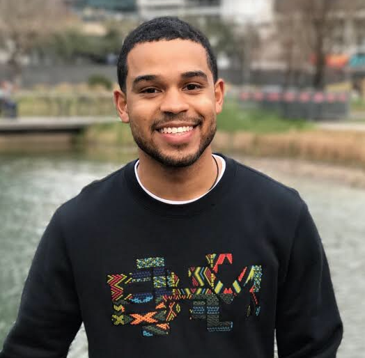
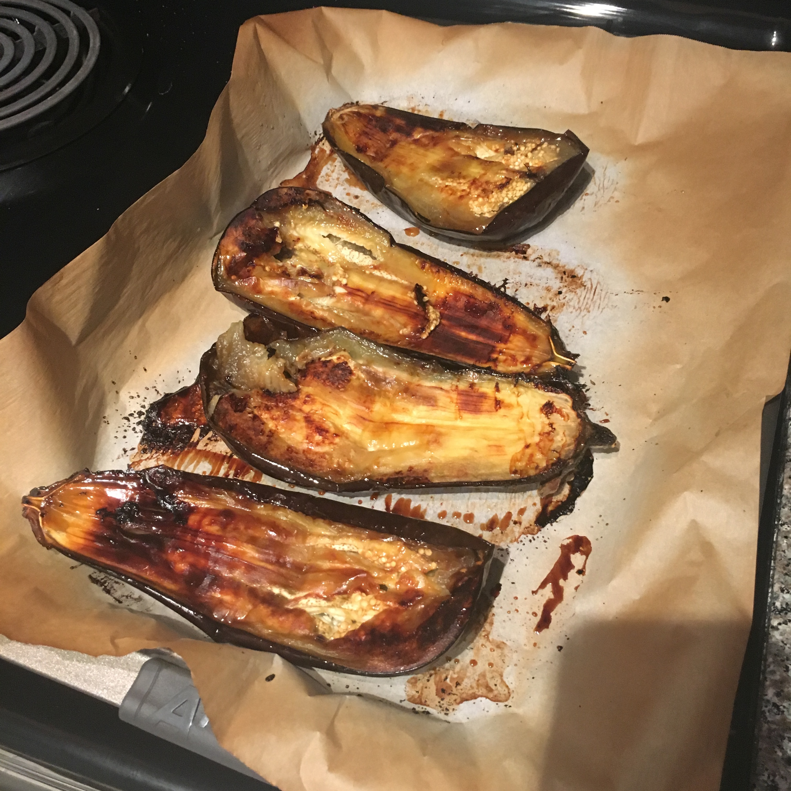
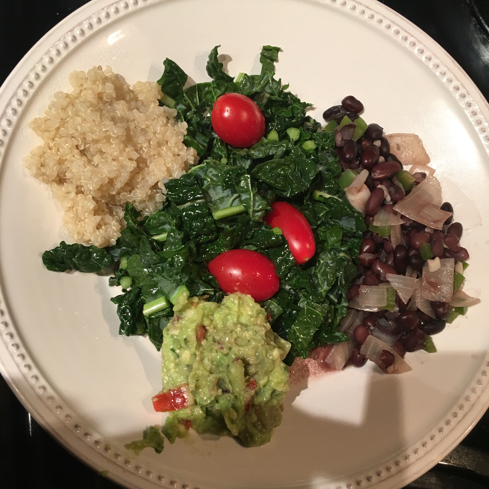
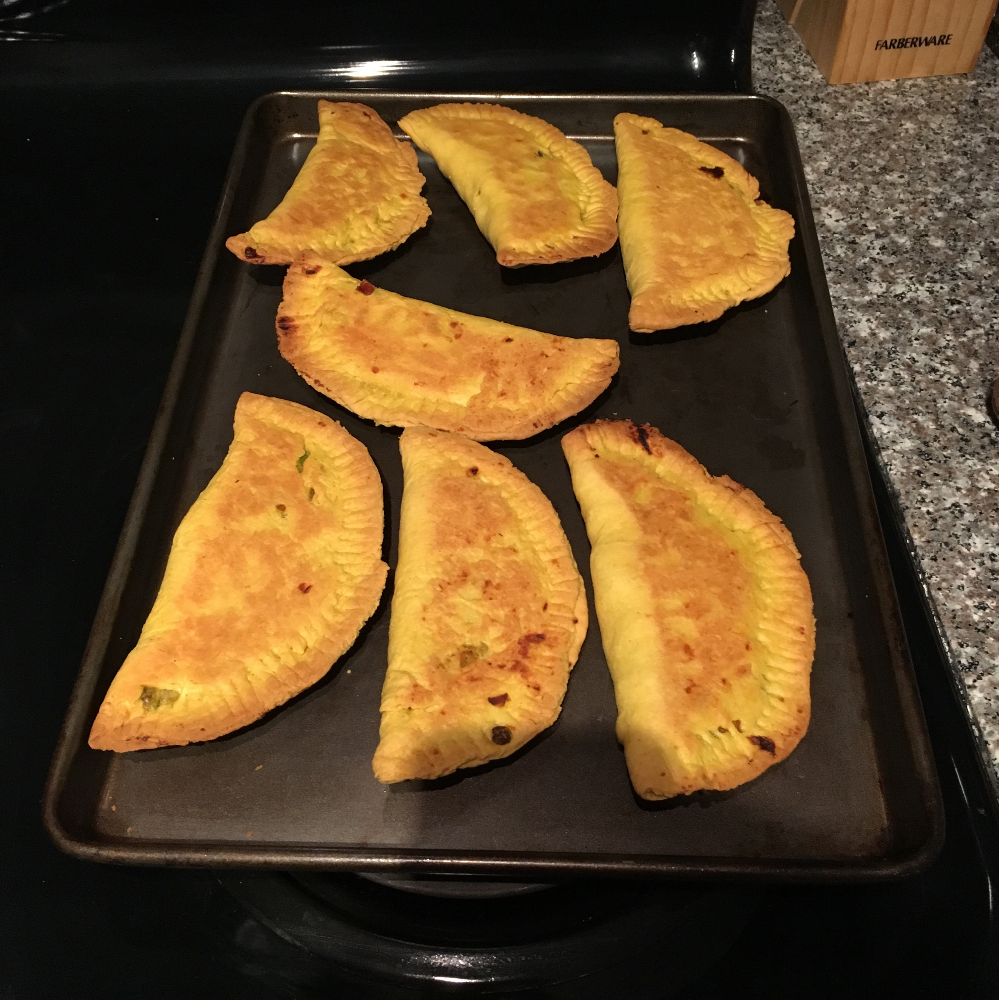
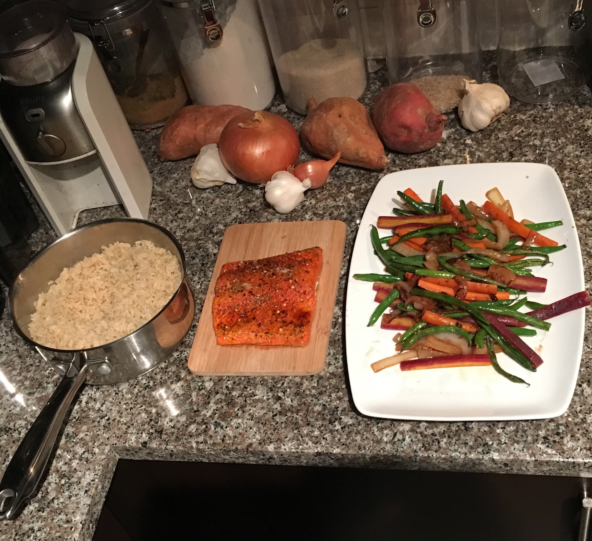
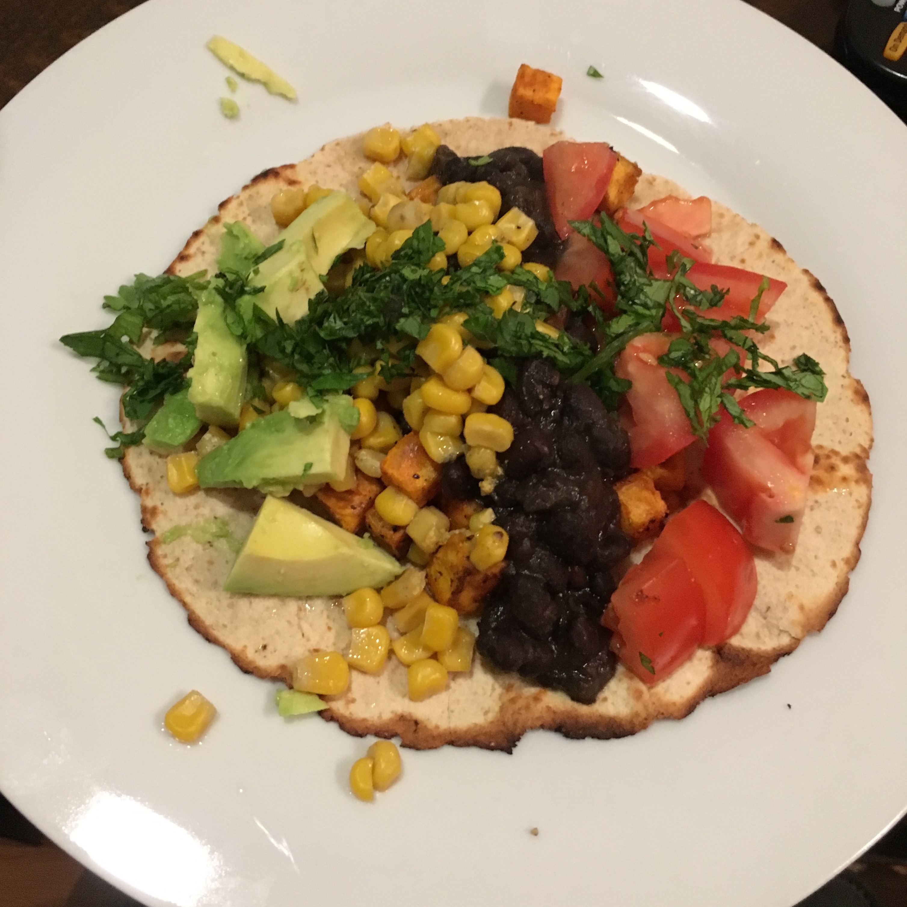

---
# You don't need to edit this file, it's empty on purpose.
# Edit theme's home layout instead if you wanna make some changes
# See: https://jekyllrb.com/docs/themes/#overriding-theme-defaults
layout: default
---

<h3>About</h3>

Hey there! I was born in Durham, NC, grew up in Plano, TX, and finished high school in Columbia, MD. During that time, I loved doing well in school, playing soccer, building relationships with my friends and family, and working as a tutor and in retail.

In 2011, I graduated from Long Reach High School and set off for MIT. There, I studied chemical engineering, played on the soccer team, and developed my interpersonal and teamwork skill set.

In 2015, I moved to Houston, Texas to start a career with ExxonMobil. During my career, I have worked alongside peers and senior leaders, solved complex technical problems, and learned as much about the systems and culture of the company as I could.

I have found my communities in the city through playing pickup basketball and soccer, cultivating my Zen practice, and exploring food experiences and night life.

<h3 class="long-border">Education</h3>

I applied to MIT believing that I wanted to study Chemical Engineering. I enjoyed the rigor of the classes, and I thrived academically, graduating with a 4.9/5.0 GPA. My favorite classes involved working in a team and working together to achieve a common goal.

My introduction to campus was through the soccer team, arriving early for pre-season conditioning and pasta nights before games.

On campus, I picked up jobs Tech Calling, grading papers for my favorite professors, and researching clean water applications.

<h3 class="long-border">Work Experience</h3>

During school, I held internships where I got to learn about manufacturing, product design, research and experimentation, and robotics and prototyping. At my senior career fair, I paired with ExxonMobil and chose them looking to apply my chemical engineering background and ultimately enjoy a secure career.

I started this career as a Business Lead on a software project where my teammates and I built several equipment design applications. I designed the logic flows and UI and collaborated with the software developers to get them to actually work.

Right now, I am a supply chain network modeler. In between collecting data and defining expectations with clients and presenting results to those that can excute changes, I analyze data and run scenarios to save money in the supply chain.

<h3 class="long-border">Goals and Whole Foods 365</h3>

Looking back, the path that brought me to want to work for Whole Foods is endless, but I think I can point out a few key moments that got me here. When I moved to Houston, I happened to choose a place that is a half mile from the WF Montrose store. During my software job, I worked three minutes walking away from WF The Woodlands. I wouldn't make groceries at Whole Foods because I didn't think it was worth it, but I did enjoy the atmosphere and employees when I would eat prepared food there.

Craving some peace in my corporate days, I turned to a Zen practice, which is actually a mile away from the Whole Foods 365 at Independence Heights. The next year in very quick succession, my friend let me borrow a book called Healing with Whole Foods and my coworker went vegan. Reading about the benefits of an organic, whole food, plant-based diet and how it naturally increases mood and mindfulness resonated directly with my Zen practice. My coworker was insisting I try her recipes, and I decided to make everything from scratch to craft the most mindfully curated and delicious meal. The produce and bulk aisles of Whole Foods have basically been my second home since then.

By changing my diet - I was vegan for a while but am now plant-based with responsibe animal products - I have been able to see the impact of eating food from Whole Foods has had on my life. I have been on this journey for about a year now, and I have seen the happiness and clean energy that it has afforded me. My purpose is now to impact people's lives as mine was now that I have begun to understand proper nourishment, for myself and the planet.

I am thrilled at the chance to join the inaugural team at Whole Foods 365 Independence Heights. I want to learn as much as I can about how the store runs, and I would love to help shape the character of a brand new store. Whole Foods has made healthy living easy for me, and now I want to help others do the same.

<h3 class="long-border">Some of My Meals</h3>

 

    
I roasted this eggplant to make baba ganoush. This is so easy and incredibly flavorful that I do it whenever I can find organic eggplants.

  

 

    
I love how eating whole foods like this homemade bowl make me feel. I like to cook my black beans from scratch to customize their flavor by adding different ingredients at different times.

  

 

    
I made two different fillings for these Jamaican patties, one corn and black beans and the other potato curry. I like to make these for my friends because they take some time and clean up.

  

 

    
When I am more active, I eat animal protein to help my body recover quickly. I usually choose fish, and I have been experimenting with fish other than salmon to give my body some variety.

  

 

    
It's hard to see in this picture, but I love slow cooking potatoes with a recipe I learned from <i>The Food Lab</i> by Kenji Lopez Alt. They come out extra sweet and crunchy, and they make a great base for tacos.

  

